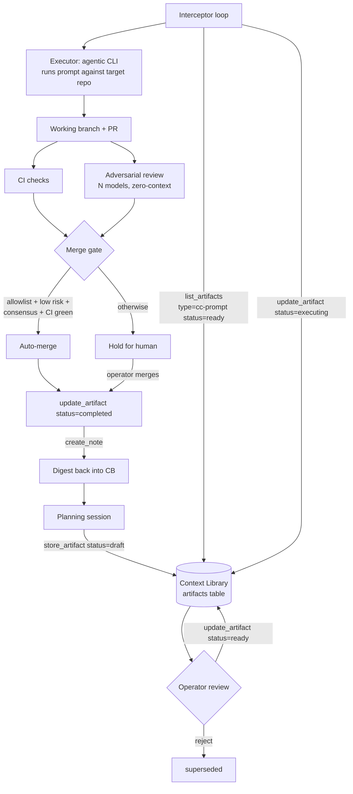

# The Autonomous Pipeline Pattern

Context Library's four content primitives — handoffs, tasks, notes, artifacts — map to the [four questions](../../ROADMAP.md#design-philosophy-four-primitives) an operator needs to answer across sessions: *Where am I? What do I need to do? What do I know? What have I produced?* Together, they are also enough substrate to run an autonomous build pipeline. A planning session stores `ready` artifacts. An interceptor process polls for them, runs each one as a prompt against a target repo, opens a PR, gates the merge behind adversarial review and CI, and writes a digest note back into Context Library so the loop closes.

This tree documents the pattern. It is not the code. The reference implementation is private; what is portable — the contracts, the state model, the governance — is here.

## Scope

This documents a **pattern, not a product**. The reference implementation is private. These pages give you the contracts (artifact shape, status transitions, executor inputs) and the governance model (adversarial review, risk-gated merge policy) so you can build your own interceptor on top of a Tier 2+ Context Library deployment. How you secure the executor, isolate the target repos, and operate the loop is your responsibility. Recommendations are made; guarantees are not.

## Architecture

Every arrow is either a Context Library MCP tool call or an external action (executor, PR host, CI). The interceptor never mutates the target repo directly; it drives an agentic coding CLI, which drives the repo. The interceptor never merges without the gate passing, and the gate is the same for every artifact regardless of who planned it.

## Contents

| Page | What it covers |
|---|---|
| [handoff-lifecycle.md](handoff-lifecycle.md) | The store/patch/get cycle, session boundary discipline, session labeling convention, anti-patterns that corrupt the handoff chain |
| [artifact-lifecycle.md](artifact-lifecycle.md) | The five artifact states, what each one means operationally, execution_order and dependencies, inline vs pointer storage |
| [adversarial-review.md](adversarial-review.md) | Zero-context multi-model review as a merge gate, consensus semantics, risk classification, honest limits of the technique |
| [build-your-own-interceptor.md](build-your-own-interceptor.md) | Replication spec: prerequisites, polling loop, executor contract, gate stage, merge decision, digest, failure handling, pseudocode |
| [claude-md-conventions.md](claude-md-conventions.md) | CLAUDE.md as the per-repo contract between operator and coding agent; conventions that make pipeline execution reliable |
| [examples/example-handoff.json](examples/example-handoff.json) | A complete, fabricated handoff illustrating the current schema and session labeling |
| [examples/example-cc-prompt.md](examples/example-cc-prompt.md) | A complete CC-prompt artifact for a small fictional change; the shape the interceptor consumes |
| [examples/lifecycle-walkthrough.md](examples/lifecycle-walkthrough.md) | Narrative end-to-end trace of one artifact through the whole loop |

## Prerequisites at a glance

- Context Library deployed at Tier 2 or higher (artifacts require Postgres).
- An agentic coding CLI that can run non-interactively against a working directory.
- A git host with API access for opening PRs and posting review comments.
- CI on target repos (the adversarial review gate assumes CI is a first-class merge signal).

Details, including a governance table for the merge decision, are in [build-your-own-interceptor.md](build-your-own-interceptor.md).
