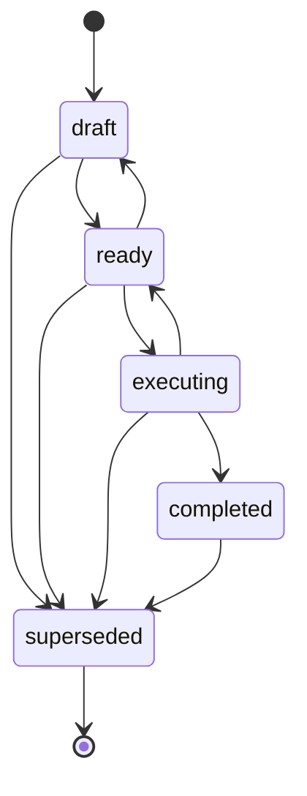

# Artifact Lifecycle

Artifacts answer *What have I produced?* They are the fourth content primitive — generated outputs (CC prompts, research documents, templates, blog drafts, prompt chains) with a status lifecycle and execution ordering. Artifacts are how planning and execution are decoupled: a planning session writes a `ready` artifact; an execution session — human or automated — picks it up later.

The pipeline pattern is built on this decoupling. Everything the interceptor consumes and produces is an artifact.

## The five states

Transitions are enforced by the server (`update_artifact` returns a validation error if you attempt an illegal move). `superseded` is reachable from any state — it is the retirement tombstone, not a completion signal.

## What each state means operationally

Understanding the *meaning* of a state matters more than memorizing the transition graph. The pipeline treats these states as coordination points between operator, planner, and interceptor.

### draft — human review pending

The artifact exists in Context Library. It is searchable and retrievable, but it should not be acted on yet. `draft` means: **an operator has not yet said this is fit to run.**

New artifacts default to `draft` when `status` is omitted on `store_artifact`. A planning session should almost always leave its output in `draft` — the promotion to `ready` is a separate step, ideally taken by a human who has actually read the artifact.

### ready — pipeline may pick this up

Promotion to `ready` is an **authorization act, not a bookkeeping act**. It says: this artifact has been reviewed, its objective is clear, its acceptance criteria are runnable, and any process watching for `ready` artifacts is permitted to execute it.

The interceptor's polling query is `list_artifacts({artifact_type: "cc-prompt", status: "ready"})`. If you would not want that query to return an artifact, do not set it to `ready`. The state transition is the trust boundary — treat it as such.

### executing — claimed by an executor

`executing` doubles as a **mutex**. The interceptor claims work by transitioning `ready → executing` atomically; a second interceptor that queries afterward will not see the artifact in its result set. If two interceptors race, the losing update surfaces as an invalid status transition (`executing → executing` is a no-op at the tool layer but the row's existing state signals the race to a caller that expected `ready`).

An `executing` artifact is a **claim**, not a proof of progress. If the executor crashes, the artifact stays `executing` until manual recovery. See the failure handling section in [build-your-own-interceptor.md](build-your-own-interceptor.md).

### completed — execution finished with outcome recorded

`completed` means the execution attempt terminated with a recorded outcome. It does not mean success — a merged PR and a reverted PR both end in `completed`, and the distinction lives in the artifact's `metadata` (typically fields like `pr_url`, `merged`, `outcome`, `commit_sha`) and in the digest note that closes the loop.

Do not overload `completed` with success semantics. The status answers "did the pipeline finish handling this?"; the metadata and the digest note answer "did the change ship?"

### superseded — retired

`superseded` retires an artifact. Use it when:

- A newer artifact replaces this one (typically referenced from the new artifact's `metadata.supersedes`).
- The plan changed and this artifact will never run.
- The artifact was found to be flawed after promotion to `ready` and needs to be pulled back out of the interceptor's polling window without deleting the record.

`superseded` is the terminal state. Once an artifact is superseded, it is not resurrected — a corrected version is stored as a new artifact.

## execution_order and dependencies

Two mechanisms sequence artifacts. They compose.

### execution_order

`execution_order` is an integer slot within an `artifact_type`. The unique constraint is `(artifact_type, execution_order) WHERE execution_order IS NOT NULL`, so different types share the number space independently but a duplicate within a type returns `EXECUTION_ORDER_CONFLICT`.

Use it for ordered batches — a prompt chain where step 1 lays foundation, step 2 adds tests, step 3 updates docs, and the interceptor must run them in that order. `list_artifacts({artifact_type, status: "ready"})` sorts by `execution_order ASC` when an `artifact_type` filter is present, so the interceptor naturally sees the batch in order.

Leave `execution_order` null when order does not matter. A batch of independent research prompts does not need slots.

### dependencies

`dependencies` is a UUID array of artifacts that must complete before this one. Where `execution_order` says "second in a chain of this type," `dependencies` says "wait until this specific other artifact is `completed`, regardless of type or slot."

Use it when:

- An artifact crosses type boundaries (a `cc-prompt` depends on a `research` artifact being consumed first).
- Ordering isn't linear (two artifacts both depend on a third, then either can run).
- You want the interceptor to enforce the wait explicitly rather than relying on the operator getting the order right by hand.

Dependencies are validated at write time. `store_artifact` and `update_artifact` reject dependency UUIDs that don't exist (`VALIDATION_ERROR`), and malformed UUIDs are caught before the database cast.

The interceptor is responsible for honoring dependencies at execution time — it should skip an artifact whose dependencies aren't all `completed` and re-check on the next poll.

## Inline content vs pointer storage

An artifact must have either `content`, `pointer`, or both. The choice comes down to size and canonical source.

| Mode | When | Trade-off |
|---|---|---|
| Inline `content` only | Small artifacts: CC prompts, snippets, short research summaries | Full-text and semantic search work directly on the artifact body |
| `pointer` only | Large or binary artifacts stored elsewhere: generated images, repo files, large media | The artifact body isn't in the FTS/embedding index — search must lean on `title`, `tags`, and `metadata` |
| Both | Content is a preview/summary; pointer is the canonical source | Best of both: preview is searchable, canonical source stays where it lives |

Pointer shape is intentionally free-form (`{type: "git", repo, branch, path}`, `{type: "local", path}`, `{type: "url", href}`, or a deployment-specific scheme). The server does not fetch pointers — it stores them and hands them back on `get_artifact`. Interpretation is the executor's job.

## Immutable content on locked statuses

Once an artifact transitions to `ready`, `executing`, or `completed`, its content is treated as immutable — the `content_hash` (SHA-256, stored in `metadata`) is set from the actual stored content and cannot be overridden by the caller. The interceptor uses this hash to verify that the artifact it read on poll is the same artifact it is executing. Reverting to `draft` clears the hash.

If a locked artifact needs to change, the correct move is to store a new artifact (typically with `metadata.supersedes` pointing at the old one) and `update_artifact` the old one to `superseded`. This preserves the audit trail — the interceptor can always trust that what it ran matches what was captured.

## Where the interceptor fits

The interceptor's whole state machine is expressed in artifact transitions:

- Poll `list_artifacts({status: "ready"})` for work.
- `update_artifact(status: "executing")` to claim it — this is the mutex.
- Run the executor.
- `update_artifact(status: "completed", metadata: {...outcome})` when the PR is merged, reverted, or otherwise resolved.

The full loop, including CI and adversarial review, is documented in [build-your-own-interceptor.md](build-your-own-interceptor.md).
